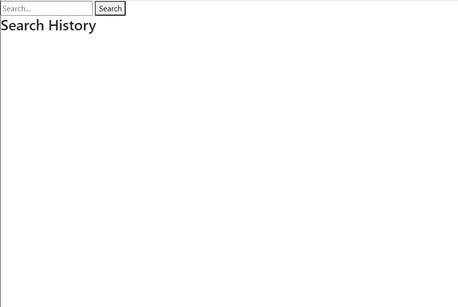


# Module 6 Challenge - Weather App
## Technology Used 

| Technology Used         | Resource URL           | 
| ------------- |:-------------:| 
| HTML    | [https://developer.mozilla.org/en-US/docs/Web/HTML](https://developer.mozilla.org/en-US/docs/Web/HTML) | 
| CSS     | [https://developer.mozilla.org/en-US/docs/Web/CSS](https://developer.mozilla.org/en-US/docs/Web/CSS)      |   
| Git | [https://github.com/](https://github.com/)     |    

## Description 

[Visit the Deployed Site](https://justinschoi93.github.io/module-6-challenge-JC93/)

I created a weather app from scratch using HTML, CSS, javascript, and APIs from OpenWeather. 

## Usage 

Search for the city you'd like to see the weather for... and voila!

## Acceptance Criteria

GIVEN a weather dashboard with form inputs
WHEN I search for a city
THEN I am presented with current and future conditions for that city and that city is added to the search history
WHEN I view current weather conditions for that city
THEN I am presented with the city name, the date, an icon representation of weather conditions, the temperature, the humidity, and the wind speed
WHEN I view future weather conditions for that city
THEN I am presented with a 5-day forecast that displays the date, an icon representation of weather conditions, the temperature, the wind speed, and the humidity
WHEN I click on a city in the search history
THEN I am again presented with current and future conditions for that city

## Learning Points 

The purpose of this project was to practice requesting, reformatting and parsing through data through the use of an API. It was also a great opportunity to practice the basics of HTML, CSS and javascript. 

## My Info

* [LinkedIn](https://linkedin.com/in/justinchoica)
* [Github](https://github.com/justinschoi93)

# 

<!-- "current": 
    data.current: {
        "dt": 1711319747,
        "sunrise": 1711315687,
        "sunset": 1711360072,
        "temp": 285.66,
        "feels_like": 284.12,
        "pressure": 1016,
        "humidity": 44,
        "dew_point": 273.75,
        "uvi": 0.32,
        "clouds": 0,
        "visibility": 10000,
        "wind_speed": 3.6,
        "wind_deg": 100,
        "weather": [
            {
                "id": 800,
                "main": "Clear",
                "description": "clear sky",
                "icon": "01d"
            }
        ] -->

<!------------------------------------------------ Daily -->
<!------------------------------- Today -->
data.daily[0]:{
    "temp": {
        "day": 286.49,
        "min": 281.07,
        "max": 287.74,
        "night": 281.07,
        "eve": 282.5,
        "morn": 285.18
    },

    "sunrise": 1711315687,
    "sunset": 1711360072,
    "moonrise": 1711360200,
    "moonset": 1711315620,
    "moon_phase": 0.5,
    "summary": "Expect a day of partly cloudy with rain",
    "feels_like": {
        "day": 284.92,
        "night": 278.47,
        "eve": 280.12,
        "morn": 283.74
    },
    "pressure": 1016,
    "humidity": 40,
    "dew_point": 273.18,
    "wind_speed": 4.52,
    "wind_deg": 80,
    "wind_gust": 8.54,
    "weather": [
        {
            "id": 501,
            "main": "Rain",
            "description": "moderate rain",
            "icon": "10d"
        }
    ],
    "clouds": 80,
    "pop": 1,
    "rain": 8.84,
    "uvi": 2.79
}
<!------------------------------- Tomorrow -->
<!------------------------------- The day after tomorrow -->
<!------------------------------- The day after the day after tomorrow  -->
<!------------------------------- 4 days from today -->
<!------------------------------- 5 days from today -->
<!------------------------------- 6 days from today -->
<!------------------------------- A week from today -->

